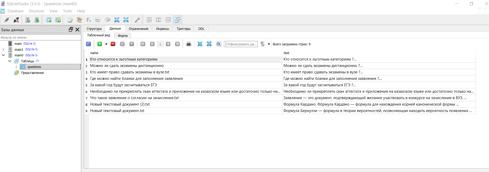
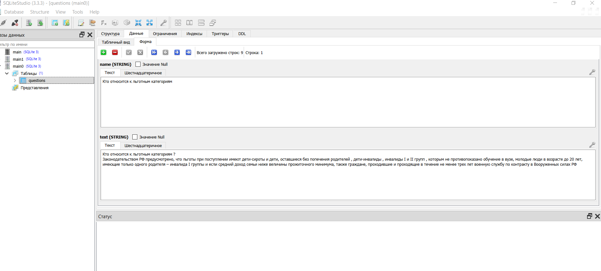
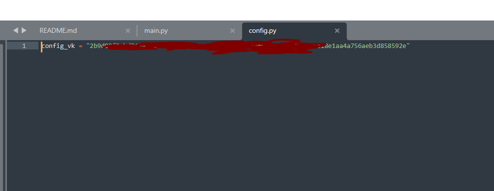

# support vk bot
автоответы для типовых вопросов , на базе вк апи
 
## 🍪описание алгоритма поиска:

1 : Создается список всех слов \
2 : Слова приводятся к именительному падежу с помощию pymorphy2\
3 : Производится поиск слов по статьям и подсчитывается частота вхождения каждого слова\
4 : Запись результата в index.json 
## 🍪описание алгоритма запроса к боту: 
1 : Создается список всех слов из запроса\
2 : Слова приводятся к именительному падежу с помощию pymorphy2\
3 : Производится поиск слов по index.json \
4 : Подсчет веса каждой статьи по числу вхождения всех слов\
  примечание - чем больше разных  из запроса слов входит в статью тем она будет выше 

## 🍪заполнение базы данных main.bd:

для редактирования файла main.bd можно использовать программу
SQLiteStudio. В графу name нужно ввести уникальное имя стать ,
а text хранит в себе текст статьи .

## 🍪заполнение config.py:

файл создается при первом запуске main.py . Его можно изменять позже

## 🍪пример работы:

можно задать вопрос боту в любом падеже и бот постарается найти самый подходящий ответ из базы